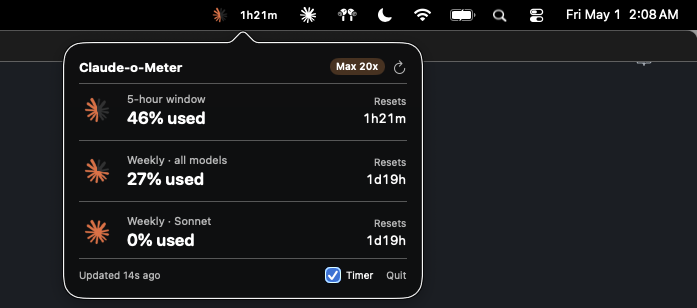

# Claude-o-Meter

A native menu-bar / system-tray app for **macOS** and **Windows** showing
your real-time Claude Pro/Max **5-hour** and **weekly** subscription usage.

Pulls live numbers straight from the same Anthropic endpoint the Claude
desktop app's Settings → Usage page uses, so the percentages match
exactly — no estimation, no token thresholds, no hardcoded plan limits.

The icon is a Claude burst that drains clockwise as you use up the 5-hour
window: full bright orange when fresh, gray ghost when exhausted.



## Install

Grab the latest binary from
**[Releases](https://github.com/jwlutz/claude-o-meter/releases/latest)**.

### macOS (Apple Silicon)

Download `claude-o-meter-macos-arm64.tar.gz`, then:

```bash
tar xzf claude-o-meter-macos-arm64.tar.gz
cd claude-o-meter
./install.sh
```

The installer copies the binary into `~/Library/Application Support/`,
registers a LaunchAgent (autostart on every login), and starts it.

**On first launch** macOS will prompt once: "security wants to access
Claude Safe Storage." Click **Always Allow** — that's the only prompt
you'll ever see.

If Gatekeeper warns about an unidentified developer (the binary is
ad-hoc signed), right-click the `claude-o-meter` binary → **Open** once.
Future launches go straight through.

To stop and remove: `./uninstall.sh` from the same folder.

### Windows (x64)

Download **`Claude-o-Meter_0.1.0_x64-setup.exe`** (recommended — smaller
NSIS installer) or `Claude-o-Meter_0.1.0_x64_en-US.msi` (WiX, for
admin-managed installs).

Double-click to install. Windows SmartScreen will warn the binary is
unsigned — click **More info → Run anyway**. The app registers itself
as a login item and shows up in the system tray.

If Windows 11 hides the icon under the `^` chevron, drag it out next
to the clock.

To uninstall: Settings → Apps → Claude-o-Meter → Uninstall.

## Requirements

| | macOS | Windows |
|---|---|---|
| OS version | 13+ (Ventura) | 10/11 x64 |
| Claude desktop app | installed and signed in | installed and signed in |
| Subscription | Pro / Max 5x / Max 20x | Pro / Max 5x / Max 20x |

The Claude desktop app provides the auth — the app reads its keychain
key (macOS) or OAuth token (Windows) to call the same usage endpoint.
No Python, no third-party deps; everything statically built.

## How it works

Both platforms follow the same pattern, with platform-appropriate auth:

1. Authenticate as the Claude desktop app:
   - **macOS**: read the `Claude Safe Storage` AES key from the login
     keychain via `/usr/bin/security`, decrypt the `.claude.ai` cookies
     (Chromium AES-128-CBC) using CommonCrypto.
   - **Windows**: read the OAuth bearer token from
     `%USERPROFILE%\.claude\.credentials.json`, refresh it via
     `platform.claude.com/v1/oauth/token` if expired.
2. Read your `organizationUuid` from `~/.claude.json:oauthAccount`.
3. `GET https://api.anthropic.com/api/oauth/usage` (Windows) or
   `https://claude.ai/api/organizations/<orgId>/usage` (macOS) with the
   decrypted cookie jar.
4. Render a tray/menu-bar icon with the burst silhouette plus a
   clockwise pie wedge that drains as the 5-hour utilization rises.
5. Re-fetch every 60 seconds (macOS) / 5 minutes (Windows — endpoint
   rate-limits more aggressively on that path).

The API returns `utilization` percentages directly, so there's nothing
estimated.

## Build from source

You don't need this unless you want to hack on it.

### macOS

```bash
git clone git@github.com:jwlutz/claude-o-meter.git
cd claude-o-meter
./scripts/install.sh
```

`scripts/install.sh` creates a self-signed code-signing identity
("ClaudeMeter Dev") in your login keychain on first run and uses it to
sign every rebuild — keeps the keychain ACL stable so you only ever
see one prompt.

### Windows

```cmd
git clone https://github.com/jwlutz/claude-o-meter.git
cd claude-o-meter\windows\src-tauri
cargo tauri build
```

Requires the Rust toolchain (rustup with MSVC), Visual Studio Build
Tools 2022 with the C++ workload, and the WebView2 runtime (already on
Windows 11). Output goes to `target/release/bundle/`.

## Layout

```
claude-o-meter/
  Sources/                              # macOS — Swift
    ClaudeoMeterCore/{UsageSnapshot,Formatting}.swift
    ClaudeoMeterApp/{main,AppDelegate,UsageStore,UsageProbe,
                     ClaudeBadge,PopoverView}.swift
  windows/                              # Windows — Tauri 2 (Rust)
    src-tauri/src/{main,probe,types,icon_render,
                    cookies,settings,font5x7}.rs
    dist/index.html                     # popover webview
  scripts/
    build.sh                            # build + ad-hoc sign (macOS)
    install.sh                          # source-tree installer (macOS)
    installer.sh                        # bundled-binary installer (macOS)
    uninstall.sh
    clean-keychain.sh
  .github/workflows/release.yml         # CI: builds both, attaches to tags
```

## Reset semantics

Both percentages and reset timestamps come from Anthropic — nothing is
computed locally. The 5-hour window resets 5 hours after the first
request in it; the weekly window resets at a fixed weekly cadence.

## What's counted

The endpoint aggregates usage across all official Claude Code clients
on your subscription: the desktop app, the CLI, the VS Code extension,
the JetBrains plugin, and `claude-ssh` / Remote Control sessions —
across all your devices.

What's **not** counted in this gauge:
- API key billing (`ANTHROPIC_API_KEY` set) — those tokens hit
  pay-per-use API billing, not the subscription pool.
- Claude Agent SDK programs (require API key auth).
- Team / Enterprise plans — separate quota, different endpoint shape.
